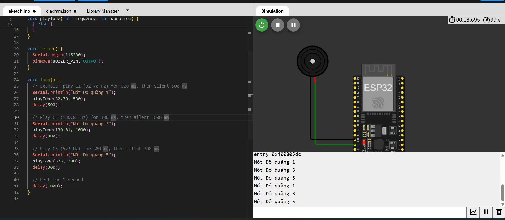

# Giao tiếp ESP32 với buzzer tần số thụ động, buzzer này sẽ phát ra âm thanh đúng với tần số được chỉ định, nếu không đúng với tần số chỉ định thì không phát ra âm thanh

[Mô phỏng Wokwi](https://wokwi.com/projects/430469980140085249)

## Kết nối Buzzer với ESP32

| BUZZER | ESP32 |
| ---- | ----- |
| Chân màu đỏ | GPIO 13 |
| Chân màu đen | GND |

## Kết quả

