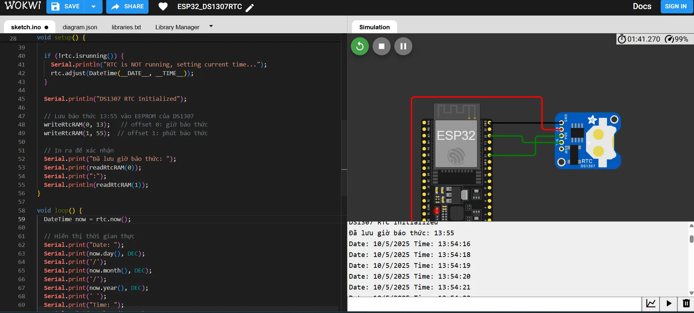
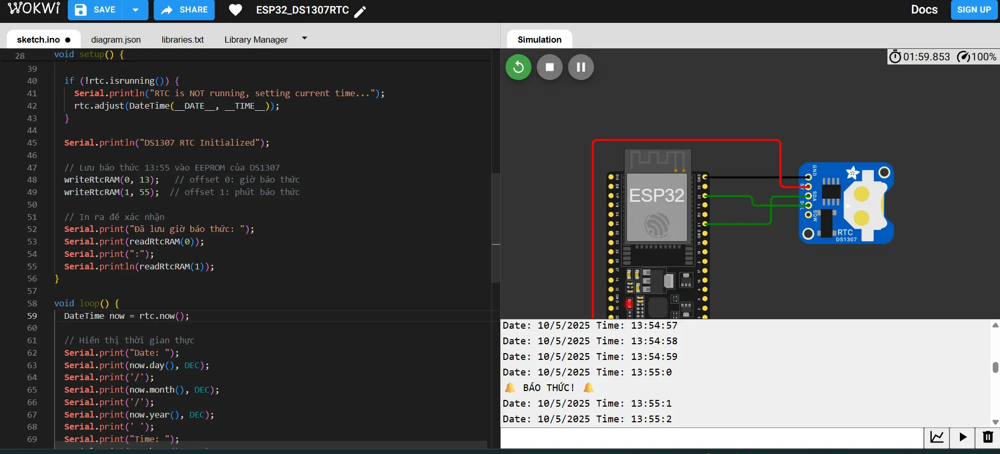

# Giao tiếp ESP32 với DS1307 RTC(EEPROM 56 byte nội bộ trong cảm biến ) hiển thị thời gian thực lên Serial monitor ngày/tháng/năm giờ/phút/giây

56 byte RAM nội bộ của DS1307 nằm từ địa chỉ thanh ghi 0x08 đến 0x3F để lưu các biến nhỏ, trạng thái hoặc log sự kiện ngắn hạn mà vẫn giữ không bị mất đi khi mất nguồn chính, tận dụng luôn module RTC mà không cần phần cứng nhớ rời.

Ví dụ ở đây demo lưu giờ vào EEPROM để làm báo thức, ví dụ là 13:55. Khi chương trình chạy nó đọc thời gian trong EEPROM ra, hiển thị thời gian thực lên Serial monitor, tiến hành so sánh thời gian thực có giống thời gian đọc được từ EEPROM không, nếu giống thì thông báo “BÁO THỨC” lên Serial monitor.

[Mô phỏng Wokwi](https://wokwi.com/projects/430470726510316545)

## Cần cài thư viện

RTClib

Adafruit Unified Sensor

## Kết nối Buzzer với ESP32

| DS1307 | ESP32 |
| ---- | ----- |
| VCC | 5V DC |
| GND | GND |
| SDA | GPIO 21 |
| SCL | GPIO 22 |

## Kết quả

Hiển thị thời gian và cập nhật mỗi 1s/lần.

Nếu thời gian thực bằng giờ đọc từ EEPROM → BÁO THỨC

