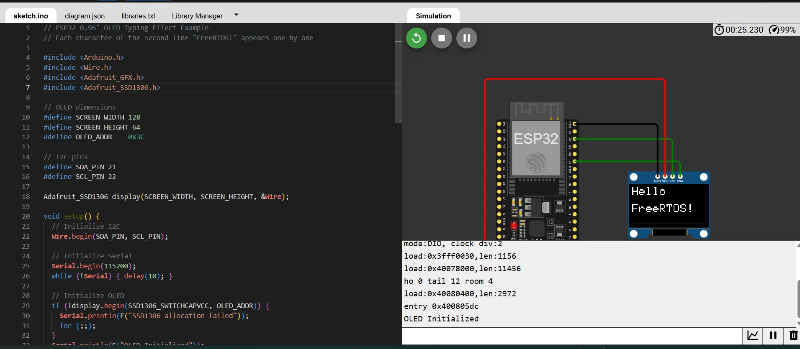

# Giao tiếp ESP32 với màn hình OLED 0.96 inch hiển thị chữ Hello, world

[Mô phỏng Wokwi](https://wokwi.com/projects/430467005854740481)

## Cần cài thư viện

Adafruit SSD1306

Adafruit GFX Library

## Kết nối OLED với ESP32

| OLED | ESP32 |
| ---- | ----- |
| VCC | 5V DC |
| GND | GND |
| SDA | GPIO 21 |
| SCL | GPIO 22 |

## Kết quả

