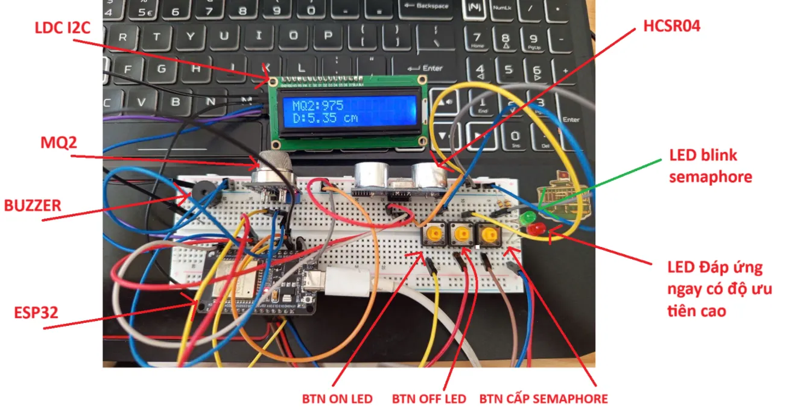

# Dùng FreeRTOS để xây dựng 1 hệ điều hành đơn giản với các cảm biến trên ESP32

## Yêu cầu

- 1 loại cảm biến(No outputDigital)(1 task) (lưu vào biến toàn cục)

- LCD hiển thị giá trị 2 cảm biến(tùy chọn) (SoftTimer 1s/lần)

- 1 task chạy buzzer tần số (thụ động)

- 2 btn bật/tắt 1 led(1 task cần đáp ứng liền)

- 1 task chạy 1 btn cấp Semaphore (max 5 lần) (semaphoreGive()=up())

- 1 task để chớp tắt 1 led (chớp tắt 3 lần, T=1s), được cấp Semaphore. (SemaphoreTake() = down())

## Mô Tả Code

- Code gồm các loại cảm biến sau: cảm biến MQ2 để thu thập dữ liệu, lấy ngõ ra analog để lưu vào biến toàn cục, cảm biến HCSR04 mục đích để thêm vào LCD để hiển thị giá trị. Ngoài các cảm biến thì còn 1 buzzer tần số để phát nhạc, 3 btn trong đó có 2 btn để bật và tắt led, 1 btn còn lại để cấp semaphore

- Gồm 5 task và 1 SoftTimer như sau

    - Task ReadMQ2SensorTask : được khai báo trong setup với độ ưu tiên là 2, bộ nhớ Stack là 2048 Words, Hàm xử lí là hàm readMQ2SensorTask dùng để đọc giá trị analog và chuyển thành digital , sau đó lưu vào biến toàn cục mq2SensorValue

    - Task PlayMelody là task dùng buzzer để phát nhạc , suspend task sau khi phát xong.

    - Task LED Control là task dùng để bật tắt led cơ bản nhưng độ ưu tiên cao hơn (3), dùng để đáp ứng ngay khi có sự kiện bật/tắt led

    - Task btnSemaphoreTask dùng để đọc nút nhấn có debounce, khi nhấn cấp semaphore và max = 5 lần.

    - Task ledBlinkTask là task chờ nhận semaphore, khi có thì sẽ blink LED
    
- Ngoài các task trên thì còn có 1 SoftTImer dùng để hiển thị giá trị lên LCD( hiển thị giá trị MQ2 value và HCSR04 value ở mỗi 1 giây)

## Kết nối HW

| GPIO (ESP32) | Tên định nghĩa | Chức năng |
| --- | --- | --- |
| **GPIO2** | `BTN_ON` | Nút bấm để **bật LED** (input với `INPUT_PULLDOWN`) |
| **GPIO5** | `ECHO_PIN` | Chân **Echo** của cảm biến siêu âm HC-SR04 |
| **GPIO12** | `LED_BLINK_PIN` | LED nhấp nháy khi nhận semaphore |
| **GPIO14** | `LED_PIN` | LED điều khiển bởi nút BTN_ON/BTN_OFF |
| **GPIO15** | `BUZZER_PIN` | Buzzer phát nhạc |
| **GPIO18** | `BTN_OFF` | Nút bấm để **tắt LED** (input với `INPUT_PULLDOWN`) |
| **GPIO23** | `TRIG_PIN` | Chân **Trigger** của cảm biến siêu âm HC-SR04 |
| **GPIO27** | `BUTTON_SEM_PIN` | Nút để cấp `Semaphore` → trigger LED nhấp nháy |
| **GPIO32** | `MQ2_SENSOR_PIN` | Chân đọc giá trị **cảm biến khí MQ2** thông qua **ADC1_CHANNEL_4** |

## Cần cài thư viện

LiquidCrystal_I2C

HCSR04

## Kết quả

Kết nối phần cứng

[Video mô phỏng](https://www.youtube.com/watch?v=2dnQlrhYvZI)
