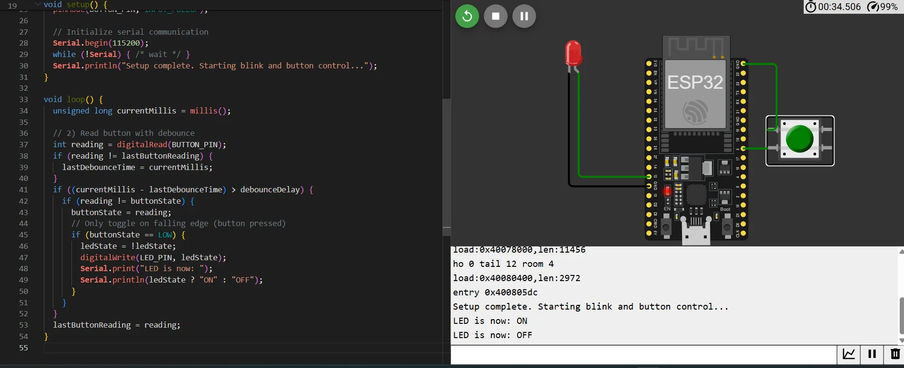

# Toggle trạng thái đèn led ON/OFF khi nhấn nhấn nút button, hiển thị trạng thái lên Serial monitor

[Mô phỏng trên wokwi](https://wokwi.com/projects/430465007367070721)

## Kết nối chân Button và LED với ESP32

| BUTTON | ESP32 |
| ------ | ----- |
| 1 Chân Button | GPIO 5 |
| 1 Chân Button | GND |

| LED | ESP32 |
| --- | ----- |
| Anode LED | GPIO 12 |
| Cathode LED | GND |

## Có xử lý debounce cho Button

Bằng set thời gian debounce

Bằng TIMER và cho TIMER lập lại khoảng 3 lần để phù hợp với nút nhấn vật lý

## Kết quả

Khi nhấn button đèn sáng, trạng thái LED trên Serial monitor : ON

Khi nhấn button 1 lần nữa đèn tắt, trạng thái LED trên Serial monitor : OFF

